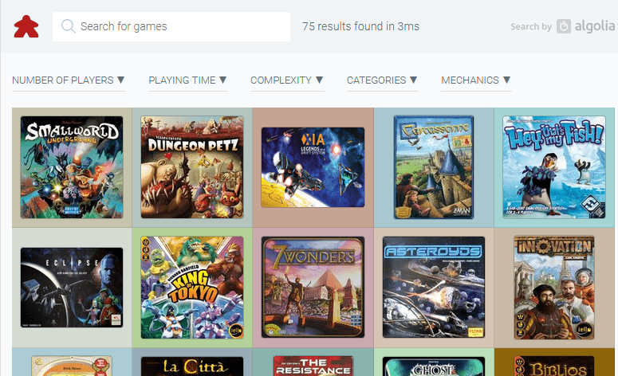

# MyBGG - Search and filter your boardgame collection

_This project is meant to be forked. The original project is available here: https://github.com/EmilStenstrom/mybgg_

Using this project, you can set up your own site for searching and filtering your boardgame collection. As an example, have a look at this: https://games.emilstenstrom.se



## Requirements

* [GitHub](https://github.com) account (free). We will serve the site using GitHub Pages.
* [Boardgamegeek](https://boardgamegeek.com) account (free). We will fetch all your games and game metadata from here.
* [Algolia](https://algolia.com) account (free). Used for creating and searching with lightning speed.
* Computer (not free) with Python 3.6+ installed.

## Getting your own site up and running the first time

1. **Fork this project** (EmilStenstrom/mybgg) to your own GitHub account.
   <details>
      <summary>Details</summary>
      Forking a project is pretty much copying it to your own GitHub account. On the top of this page, to the right, is a button called Fork. Click it and accept all the defaults. You now have a copy of this project you can make changes to.
   </details>

2. **Update the config.json-file** with your account details for Boardgamegeek and Algolia. Commit and push this file to your forked repository.
   <details>
      <summary>Details</summary>

      * To change a file in your project, you first need to get it working on your computer. You get it from GitHub to your computer by cloning it. Go to your forked project, and find the green "Clone or download"-button. If you know how Git works, you can clone it by typing `git clone YOUR_GIT_URL`. Otherwise downloading the zip-file, and unzipping it to a directory works fine too.
      * Now go into the directory that you just created, and edit the file called config.json.

      ```js
      {
          "project": {
              "name": "mybgg",  // This is the name of your project. You can leave it as it is.
              "title": ""  // This is the page title. If you leave this empty, a title will be
                           // created from your BGG username.
          },
          "boardgamegeek": {
              "user_name": "YOUR_BGG_USERNAME",  // The username on boardgamegeek that has your games
              "extra_params": {
                  "own": 1  // Here's the query that will be sent to BGG to get your games. A full list
                            // of options can be found here:
                            // https://lcosmin.github.io/boardgamegeek/modules.html#boardgamegeek.api.BGGClient.collection
              }
          },
          "algolia": {
              "app_id": "YOUR_APP_ID",  // Your Algolia APP ID. When logged in, look at the top of the
                                        // page which says: APPS > YOUR_ID_HERE
              "api_key_search_only": "YOUR_PUBLIC_API_KEY",  // Click "API Keys" in the menu to the left.
                                                             // Use the "Search-Only API Key"!
              "index_name": "YOUR_INDEX_NAME",  // All your games will be stored in something called an "index".
                                                // You can create and index by going to "Indices" in the menu to the left.
                                                // Click to create a new index, and give it a name. Put the name you choose here.
              "hits_per_page": 48,  // Number of games you want to show on each page
              "sort_by": "asc(name)"  // Default sort order before the user has searched for anything.
                                      // Can be one of: asc(rank), desc(rating), desc(numrated), desc(numowned)
                                      // "asc" stands for ascending, meaning lowest number first, desc the opposite
          }
      }
      ```

      * Your're all set. If you cloned your project from github, you can commit your change by typing:

      ```
      git commit -m "Update config.json"
      git push
      ```
   </details>

3. **Install the python libraries needed** by running:<br>
   ```pip install -r scripts/requirements.txt```

   <details>
      <summary>Details</summary>

      * This step requires that you have (at least) Python 3.6 installed. You can download it from https://python.org if you need to.
      * The installer installs a command called "pip", that allows you to install libraries from the internet. It could be called "pip3.6" instead, so try typing that instead of pip if you don't get it working.
      * The mybgg project comes with a requirements.txt file, that specifies which version of things it needs. So go to the project, and type the above command there. Everything you need should be installed.
   </details>

4. **Download your games from boardgamegeek and send them to algolia**:<br>
   ```python scripts/download_and_index.py --apikey YOUR_ALGOLIA_ADMIN_API_KEY```

   (_Note that this API KEY is NOT the same as the one you put in config.json. Never share your admin api key publicly_)

   <details>
      <summary>Details</summary>

      * This step requires that you have (at least) Python 3.6 installed. You can download it from https://python.org if you need to.
      * Python could be installed as either "python", or "python3.6". Try the other version if the first doesn't work for you. You'll probably get "Invalid syntax"-errors if you run the script with the wrong version.
      * The Algolia API key needed here can be found under the "API Keys" menu option, when logged in to Algolias dashboard. Pick the one called "Admin API Key", since this one will need permission to add games to your index. Never share this key publicly, since it can be used to delete your whole search index. Don't commit it to your project!
      * Running this command might give strange errors from time to time. It seems the boardgamegeek API is somewhat shaking. Just trying to run the command again usually works. If you get other errors, please post an issue here: https://github.com/EmilStenstrom/mybgg/issues
   </details>

5. **Enable GitHub Pages** on your forked repository by going into _Settings ->
GitHub Pages_. Select your master branch as Source, and click Save.

6. Your site is now available on (https://YOUR_GITHUB_USERNAME.github.io/mybgg)

## Working on your site locally

1. Go to your project directory. Run this command:

    ```python -m http.server```

    This starts a webserver in the directory you're in.

2. Open your web browser and go to `http://localhost:8000`. Voliá! Any time you make a change to your project you can just reload the page to see your changes applied. When you're happy with the result, commit your changes.

## Updating your project to the latest version when mybgg is updated

1. **Add a connection between your forked project**, and the mybgg project. We will use this "connection", or remote, to fetch the latest version. _You only need to do this the first time_.

   ```
   git remote add upstream https://github.com/EmilStenstrom/mybgg.git
   ```

2. **Fetch the latest changes** from the mybgg project:

   ```
   git fetch upstream
   ```

3. **Merge the changes you fetched** with the changes you made to your project locally:

   ```
   git merge upstream/master
   ```

4. **Update to the latest version of all external libraries** that mybgg uses internally. They can update between versions.

   ```
   pip install -r scripts/requirements.txt
   ```


5. **Push the new updated version** to GitHub:

   ```
   git push
   ```

## Projects used under the hood

* Meeple icon (CC4 Attribtion): https://icon-icons.com/icon/meeple/38522#256
* Algolia search client (MIT): https://github.com/algolia/algoliasearch-client-python
* Mobile testing with: <a href="https://www.browserstack.com"></a>
